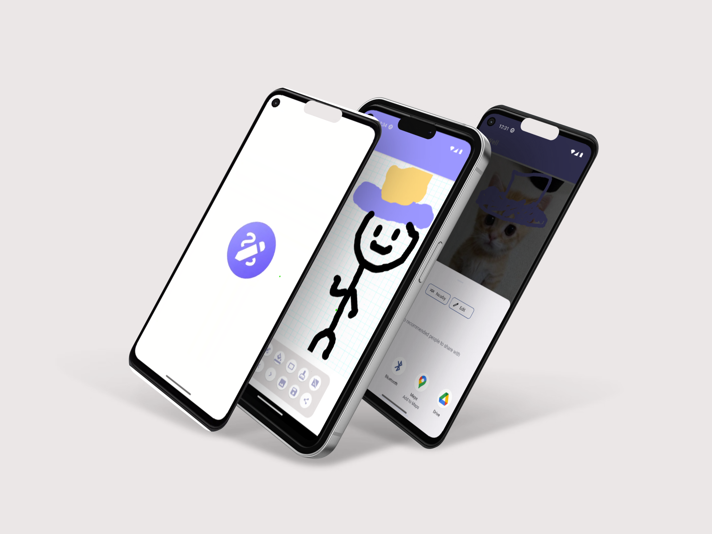

    <h1><b>InkWell</b></h1>
    <h3>Doodling app built with Kotlin in Android</h3>
    

 &nbsp;

 &nbsp;

<h3 align="center">
    🔹
    <a href="https://github.com/pranjal-barnwal/inkwell/issues">Report Bug</a> &nbsp; &nbsp;
    🔹
    <a href="https://github.com/pranjal-barnwal/inkwell/issues">Request Feature</a>
</h3>

 

## App Features
- Undo & redo strokes
- Adjustable brush size
- Selected pastel colors
- Open-source
- Ad-free
- Overlay image
- Save & share
- Modern UI

 

 

## License
[MIT License](./LICENSE)

